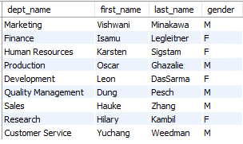
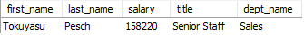

# Objective:
The project aims to address six questions asked by the Chief Operating Officer.
This will be achieved by retrieving information from the employee database
and creating an interactive dashboard.

# Tools:
MySQL Workbench, Tableau Public

# Dataset:
The dataset utilized in this project was sourced from:
[The Business Intelligence Analyst Course 2023]
https://www.udemy.com/course/the-business-intelligence-analyst-course-2018/ 
created by 365 Careers, available on Udemy.

The dataset remains unaltered and in its original form,
with no modifications made for the duration of this project.
The original lines of the license text can be found within the SQL file
and are also available in a separate "original_license.txt" file.

The employees database contains the following tables: 

departments 
 

dept_emp 
 

dept_manager 
 

employees 
 

salaries 
 

titles 
 

# Information needed by the COO:
1.	List of departments with current managers
2.	Number of employees in each department
3.	Number of male and female employees hired in years 1985-2002
4.	Average male and female salary in each department, years 1985-2002
5.	Highest earning employee
6.	Difference between the maximum and minimum earnings for each position

# Methodology:
This project follows a two-step approach to address the Chief Operating Officer's questions,
involving data extraction using SQL and data visualization using Tableau.

1.	Data Extraction with SQL: Data is extracted from the employee database using SQL queries,
    addressing the COO's six questions and ensuring data accuracy.
  	Outputs are saved as CSV files which are then opened in Tableau.
2.	Visualization via Tableau: Tableau is used to create interactive visualizations that present
    insights derived from the extracted data in an intuitive manner, aiding informed decision-making.

# Queries used to obtain the information needed:
1.	List of departments with current managers
 

2.	Number of employees in each department
 

3.	Number of male and female employees hired in years 1985-2002
 

4.	Average male and female salary in each department, years 1985-2002
 

5.	Name, salary, title, and department of the highest earning employee
 

6.	Difference between the maximum and minimum earnings for each position
 

# Outputs and visualization:
Question 1 and Question 5 do not require visualization, therefore their answers remain presented in the form of tables: 

Answer 1: 
 

Answer 5: 
 
 

Remaining answers are presented in the final dashboard created in Tableau and can be found here:
[Visualization in Tableau](https://public.tableau.com/app/profile/mateusz2359/viz/Employees_project/Employees_dashboard) 
 
 

# Conclusions:
The main conclusions that can be drawn from the analysis are as follows:
1. There are currently 5 male managers and 4 female managers.
2. Departments with the highest number of employees are Development (61,386) and Production (53,304).
3. The trend in hiring was downward, with more men than women employed in each year.
4. Average salaries for males and females were almost equal - there were no significant gender pay inequalities.
5. Employee with the highest salary is Tokuyasu Pesch, earning 158 220 as Senior Staff in Sales department.
6. The largest difference between the largest and smallest salary is in the Senior Staff position (119,208). The smallest difference is in the Manager position (49,837).
