# Objective:
The project aims to address six questions asked by the Chief Operating Officer.
This will be achieved by retrieving information from the employee database
and creating an interactive dashboard.

# Tools:
MySQL Workbench, Tableau Public

# Dataset:
The dataset utilized in this project was sourced from:
[The Business Intelligence Analyst Course 2023]
https://www.udemy.com/course/the-business-intelligence-analyst-course-2018/ 
created by 365 Careers, available on Udemy.

The dataset remains unaltered and in its original form,
with no modifications made for the duration of this project.
The original lines of the license text can be found within the SQL file
and are also available in a separate "original_license.txt" file.

The employees database contains the following tables: 
departments
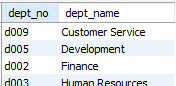
dept_emp
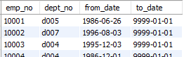
dept_manager
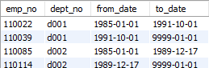
employees
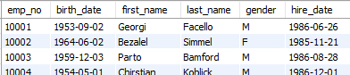
salaries
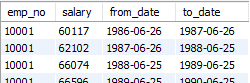
titles
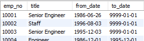

# Information needed by the COO:
1.	List of departments with current managers
2.	Number of employees in each department
3.	Number of male and female employees hired in years 1985-2002
4.	Average male and female salary in each department, years 1985-2002
5.	Highest earning employee
6.	Difference between the maximum and minimum earnings for each position

# Methodology:
This project follows a two-step approach to address the Chief Operating Officer's questions,
involving data extraction using SQL and data visualization using Tableau.

1.	Data Extraction with SQL: Data is extracted from the employee database using SQL queries,
    addressing the COO's six questions and ensuring data accuracy.
  	Outputs are saved as CSV files which are then opened in Tableau.
2.	Visualization via Tableau: Tableau is used to create interactive visualizations that present
    insights derived from the extracted data in an intuitive manner, aiding informed decision-making.

# Queries used to obtain the information needed:
1.	List of departments with current managers
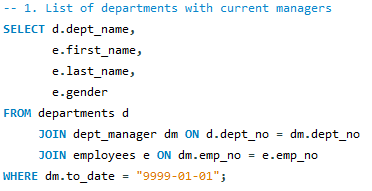
2.	Number of employees in each department
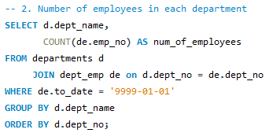
3.	Number of male and female employees hired in years 1985-2002
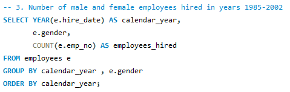
4.	Average male and female salary in each department, years 1985-2002
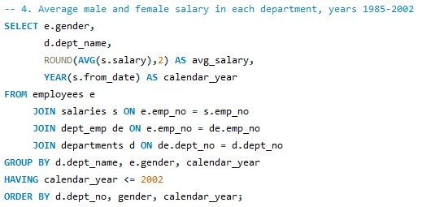
5.	Highest earning employee
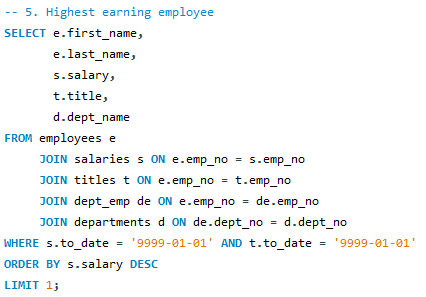
6.	Difference between the maximum and minimum earnings for each position
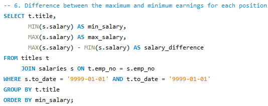

# Visualization:
The final dashboard created in Tableau can be found here:
https://public.tableau.com/app/profile/mateusz2359/viz/Employees_project/Employees_dashboard,
and looks as follows:
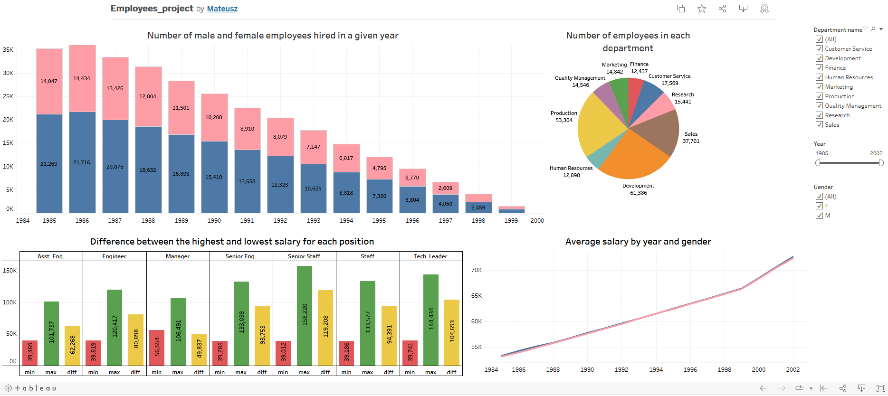
